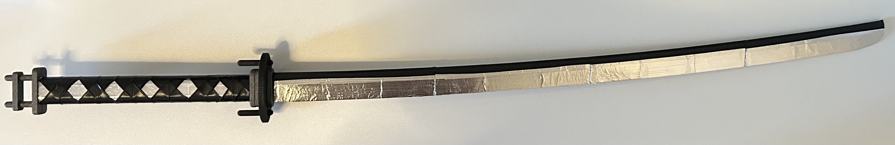
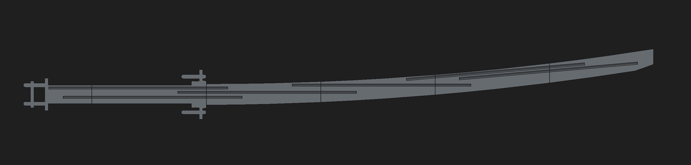

# Tailless Katana

An 88cm 3D printable model this [katana](https://zenless-zone-zero.fandom.com/wiki/Tailless).

You can probably make a better looking one with more time and effort. The 3D model also omits a few details.

## 3D Printing

Please see the `3mf` directory.

## Assembling

You will need 6 carbon fibre rods of 25cm length and 3mm diameter for structural support.

Prepare about 200g of printing material. You might need to reprint some badly printed parts.

Notice that there are 6 parts per side. Use a strong tape that is not too elastic to put the left and right parts together. Then inserting the rods to secure the different segments together.

If two segments are too loose together. Make the rod diameter slightly larger by adding table on it.

Afterwards, you may use reflective tape to give the blade a metallic look. In my case, I wanted the blade to be modular, so I did not connect the blade segments together with the metallic tape. It will look better connected.

Finally, for the handle, use black and/or metallic acryllic paint, reflective tape, and electrical tape.

## License

Wei. CC BY-NC 4.0